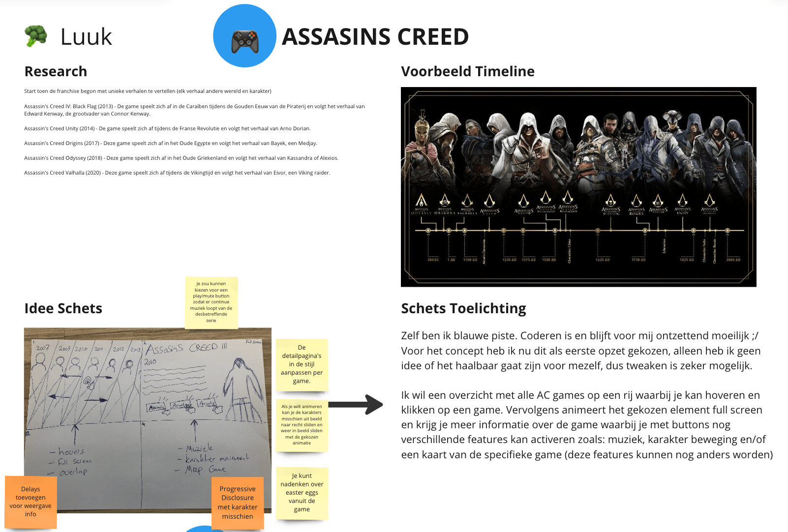

# Procesverslag
Markdown is een simpele manier om HTML te schrijven.  
Markdown cheat cheet: [Hulp bij het schrijven van Markdown](https://github.com/adam-p/markdown-here/wiki/Markdown-Cheatsheet).

Nb. De standaardstructuur en de spartaanse opmaak van de README.md zijn helemaal prima. Het gaat om de inhoud van je procesverslag. Besteedt de tijd voor pracht en praal aan je website.

Nb. Door *open* toe te voegen aan een *details* element kun je deze standaard open zetten. Fijn om dat steeds voor de relevante stuk(ken) te doen.

## Jij

### Ontwerper:
Luuk van den Bor

#### Je startniveau:
Mijn startniveau is: Blauw

# Je plan

  
De eerste versie/schets van je ontwerp & je persoonlijke uitdaging

  ### De eerste versie/schets:
  

  ### Je ambitie:
  Aan deze technieken/punten wil ik werken:
  - Animatie
  - Grid gebruik
  - Misschien klein stukje javascript (als het mogelijk is)

## Voortgang/Feedback 1

  
Mijn bevindingen + wijzigingen (minimaal 5)

  ### Bevindingen:
  Omschrijving van wat er nog niet orde was (tekst en afbeeding(en)).

  

  Feedback punten:

  Je zou kunnen kiezen voor een play/mute button zodat er continue muziek loopt van de desbetreffende serie

  De detailpagina's in de stijl aanpassen per game.

  Als je wilt animeren kan je de karakters misschien uit beeld naar recht sliden en weer in beeld sliden met de gekozen animatie

  Je kunt nadenken over easter eggs vanuit de game

  Progressive Disclosure met karakter misschien

  Delays toevoegen voor weergave info

  #### Oplossing:
  Beschrijving hoe je het hebt hebt opgelost of als het niet gelukt is hoe je het zou oplossen (tekst en afbeeding(en)).

  

  Op het eerste scherm heb ik de overview weergegeven met de hover animatie om de aparte games te tonen.

  Op het tweede scherm zie je per game het overzicht waarbij de elementen inschuiven op het moment dat je op de background klikt.

  Op het derde scherm heb ik een animatie uitgelicht van het karakter waarbij je met een dubbelklik (of misschien 1 klik) het element een sprong laat maken of misschien een woosh (even kijken wat haalbaar is).

  Op het laatste scherm heb ik uitgelicht dat met een button je de muziek van de game kan afspelen.

  Als ik nog tijd over heb wil ik nog een easter egg toevoegen. Eerst maar focussen op bovenstaande punten.

## Voortgang/Feedback 2

  
Mijn bevindingen + wijzigingen (minimaal 5)

  

  

  ### Bevindingen:
  Omschrijving van wat er nog niet orde was (tekst en afbeeding(en)).

  Verzorging:
  - Als je het scherm niet te veel verkleint is het goed responsive. Bij meer dan 50% vallen delen buiten het veld en zijn de characters te groot.

Semantische code
  - Alt text ontbreekt nog.

Nette code
  - In  CSS root staat een kleur.
  - Je zou meer witruimte kunnen gebruiken.
  - Uitleg ontbreekt nog.
  - Veel gebruik van PX, geen relatieve units.
  - Als je 1 x de keyframe van opacity hebt aangemaakt, moet je hem dan nog herhalen?
  - Afmetingen foto's en text grootte wordt steeds herhaald, deze kan in 1x worden geschreven.
  - Nog geen bronnen opgenomen, maar misschien NVT.

  #### Oplossing:
  Beschrijving hoe je het hebt hebt opgelost of als het niet gelukt is hoe je het zou oplossen (tekst en afbeeding(en)).

  - Alt text toegevoegd
  - Custom properties toegevoegd voor de kleuren settings
  - Alle elementen met px veranderd naar em
  - Alle algemene styling per 1 element toegepast en herhaling eruit gehaald
  - Afbeelding groottes aangepast
  - Bronnen in styling notities gezet

## Voortgang/Feedback 3

  
Mijn bevindingen + wijzigingen (minimaal 5)

  

  ### Bevindingen:
  Omschrijving van wat er nog niet orde was (tekst en afbeeding(en)).

  - Concept en details passen nog niet goed bij elkaar
  - Styling kan strakker
  - Code bij elkaar positioneren
  - Technische problemen: Witruimte ontstaat aan zijkant
  - Meer animaties toevoegen

  #### Oplossing:
  Beschrijving hoe je het hebt hebt opgelost of als het niet gelukt is hoe je het zou oplossen (tekst en afbeeding(en)).

  - Concept strakker uitgewerkt. Nu een quest game ervan gemaakt dat je per game een verstopt element moet zoeken en daar op moet klikken zodat er een animatie activeert.
  - Schaduwen toegevoegd, overgangen smoother laten lopen (Sanne), tekst styling van de quest passend gemaakt. Concept voelt nu als een geheel
  - Alle code semantisch correct neergezet (volgens mij geheel kloppend), code bij elkaar gepositioneerd en duidelijk titels gegeven
  - Witruimte probleem opgelost door Sanne. Het probleem was dat de afbeeldingen in de div uit de div staken als die opx breed was.
  - Animaties per game toegevoegd met elementen (krokodil, vogel, kat, octopus en pepsiflesje (easter egg)) die te maken hebben met de game.

## Reflectie

  
Mijn eindresultaat & persoonlijke ontwikkeling

  ### Je uitkomst - karakteristiek screenshot(s):
  
  
  
  
  
  

  ### Dit ging goed/Heb ik geleerd:
  Korte omschrijving met plaatje(s)

  

  Na het vele tweaken met positionering en styling merkte ik dat het coderen me alweer wat beter af begon te gaan. Het werken met animaties ging nu vrij soepel in tegenstelling tot vorig jaar. Daarnaast is het stylen van het gehele concept me ook veel beter af gegaan en is het nu veel meer 1 geheel. Door de zelfverzekerdheid die meer omhoog is gekomen gedurende het proces, kon ik veel sneller aanpassingen doen en elementen veranderen op de momenten dat dat nodig was. Een goed voorbeeld van wat goed ging, is dat ik eerst alle animatie properties onder elkaar staan en die heb ik uiteindelijk samengevoegd in de animation property, met de gekozen values erachter aan. Dit werkt veel efficiënter en is voor mij daarom ook erg waardevol.

  ### Dit was lastig/Is niet gelukt:
  Korte omschrijving met plaatje(s)

  

  Hetgeen waar ik de meeste moeite mee had, was het positioneren van de elementen. Voornamelijk de div's en section's. Hierdoor is uiteindelijk ook het witruimte probleem ontstaan wat uiteindelijk met de hulp van Sanne is opgelost. Verder wilde ik misschien nog een soort lock toevoegen zodat niet bij elke hover je veranderd van weergave positie. Dit zou zorgen voor meer standvastigheid en een verbetering kunnen zijn van het ontwerp.

  Over het algemeen ben ik tevreden met het resultaat. Het programmeren ging me een stuk beter af dan vorig jaar en bepaalde connecties tussen de elementen kon ik veel sneller vanuit mezelf leggen. Programmeren is zeker niet mijn eerste keus als het gaat om CMD, maar ik ben blij dat ik met dit project zelfverzekerder ben geworden in het vak.

## Bronnenlijst

continu bijhouden terwijl je werkt

Nb. Wees specifiek ('css-tricks' als bron is bijv. niet specifiek genoeg).

1. Bron voor box shadow: https://stackoverflow.com/questions/9182978/semi-transparent-color-layer-over-background-image
2. Bron voor !important: https://www.w3schools.com/css/css_important.asp
3. Bron voor transform - translate3d (smoother verloop animatie vogel): https://www.kirupa.com/html5/animating_movement_smoothly_using_css.htm
4. Bron voor draai animatie kat: http://jsfiddle.net/NfX56/3/
5. Bron voor de laatste Javascript connecties, dus click + toggle: Tom van den Berg (Student)
6. Bron voor het witruimte probleem: Sanne 't Hooft

